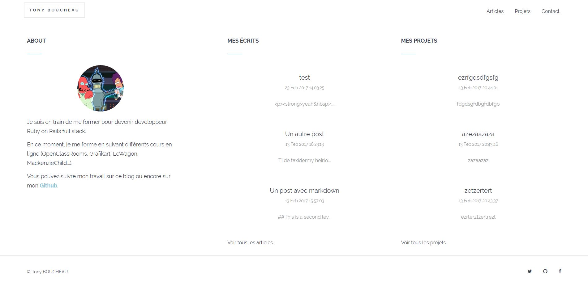
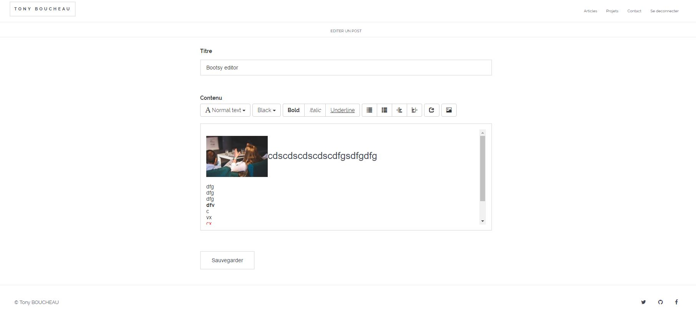

# Planifier notre application

_J'ai effectué ce projet en me basant sur les vidéos de [Mackenzie Child](mackenziechild.me) et plus précisément sur sa série de 22 vidéos sur sa chaine YouTube sur ["comment créer un blog & un portfolio"](https://www.youtube.com/playlist?list=PL23ZvcdS3XPK9Y4DRU-BiJtiY5L_QhUUq). Ces vidéos sont simples, claires, et très bien expliquées. Je vous les conseil vivement !_

1. Questions
	- Qu'allons nous créer comme application ?
	- Pour qui allons nous créer cette application ?
	- De quelles fonctionnalités allons nous avoir besoin ?
2. Cas d'utilisations
3. Modélisation des Données
4. De quelles pages allons nous avoir besoin dans notre application ?

## Questions

1. Qu'allons nous créer comme application ?
Une application ou nous allons pouvoir blogger, partager des exemples de nos projets et ou les visiteurs pourront nous contacter

2. Pour qui allons nous créer cette application ?
Nous créons cette application pour nous, mais aussi pour la communauté. Le partage de ce que nous avons appris en bloggant est une excellente façon d'apprendre sur ce que nous faisons, et nous enseignons aux autres également par ce biais. Pour permettre aux employeurs de voir par eux-mêmes ce que nous sommes capable de faire.

3. De quelles fonctionnalités allons nous avoir besoin ?
	- Posts
		- CRUD
		- Markdown / Syntax highlighting (Pour le moment seulement sur les projets, sur les posts, c'est l'[éditeur wysiwyg Bootsy](https://github.com/volmer/bootsy))
		- Commentaires (avec Disqus)
	- Projects
		- CRUD
		- Markdown / Syntax highlighting
	- Contact
		- Formulaire de Contact
		- Sendgrid (si production sur Heroku - [dans mon cas, c'est ici](https://stark-springs-19065.herokuapp.com))
	- User (Devise)

## Cas d'utilisations
En tant que **<=>**, je souhaite être capable de **<=>**, pour que **<=>**.
- En tant qu'utilisateur, je souhaite être capable de créer des posts, pour partager ce que j'ai appris sur mon blog.
- En tant qu'utilisateur, je souhaite être capable d'éditer et supprimer des posts, pour qie je puisse gérer le blog.
- En tant qu'utilisateur, je souhaite être capable d'écrire les posts en Markdown, pour que ce soit plus facile à écrire et mettre en page.
- En tant qu'utilisateur, je souhaite être capable de mettre en avant les syntax des blocks de code pour que je puisse les partager facilement sur mon blog.
- En tant qu'utilisateur, je souhaite être capable de montrer aux visiteurs et aux employeurs potentiels des exemples de mon travail ou des projets que j'ai créé.
- En tant qu'utilisateur, je souhaite être capable de permettre aux visiteurs de me contacter par un formulaire sur mon site.
- En tant qu'utilisateur, je souhaite que les visiteurs puisse laisser des commentaires sur les posts.

## Modélisation des Données

**Post**
	- title:string
	- content:text

**Project**
	- title:string
	- description:text
	- link:string

**User**
	- gérés par Devise

## De quelles pages allons nous avoir besoin dans notre application ?

- Home
- Posts#index
- Posts#Show
- Projects#index
- Projects#show
- Contact

# Mise en production de l'application
Pour la mise en production le plus simple est [Heroku](https://www.heroku.com). Pour que cela soit possible, il faut installer plusieurs modules sur son PC (surtout sous Windows) :

## 1. Préparation de votre machine locale (si c'est sous Windows)
Installez les pré-requis suivants ([comme décrit sur cette page](https://devcenter.heroku.com/articles/getting-started-with-jruby#introduction)) :

- [Java Developement Toolkit 8](https://www.oracle.com/technetwork/java/javase/downloads/index.html)
- [JRuby 9.1.5.0](http://jruby.org/files/downloads/9.1.5.0/index.html)
- `jruby -S gem install bundler`

Puis installez l'interface Heroku en ligne de commande :
- [Heroku CLI](https://cli-assets.heroku.com/branches/stable/heroku-windows-amd64.exe)
- Validez l'installation avec `heroku login` (il vous est demandé votre émail et mot de passe de compte Heroku). Vous devriez voir `Logged in as #votreEmail`

## 2. Préparation de votre Application Rails
Il va falloir modifier votre Gemfile en ajoutant un groupe production comme suit :
<pre>
	<code>
			group :production do
			  gem 'pg'
			  gem 'rails_12factor'
			end
	</code>
</pre>

## 3. Envoie en production
Dès que vous êtes satisfait de votre code, il ne reste qu'à l'envoyer en production :
- `git add .`
- `git commit -am "Code prêt pour la production"`
- `git push`
- `git push heroku master`

Vous devriez voir la sortie suivante sur votre terminal :
<pre>
	<code>
		remote: Verifying deploy... done.
		To https://git.heroku.com/#nom_de_votre_app_heroku.git
		   b068051..2b0482c  master -> master
	</code>
</pre>

#ToDo
- Refonte du style suite à l'ajout de Bootsy il y a des bugs
- Ajout de Bootsy sur les projets
- Ajout d'un module d'administration
- Ajout d'une gestion dynamique de la page d'accueil (section "about")

## Application en production
(à retrouver [ici](https://stark-springs-19065.herokuapp.com/))

